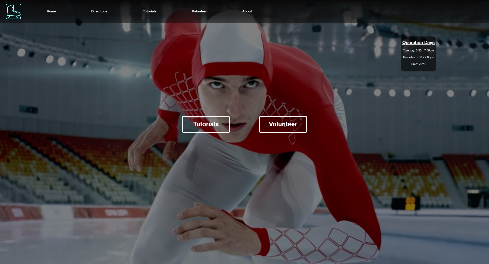
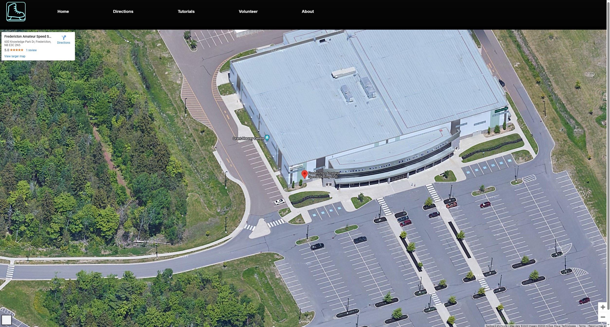
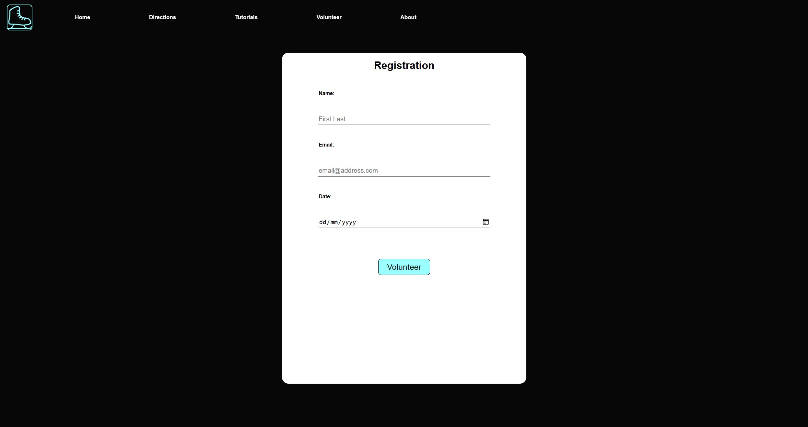
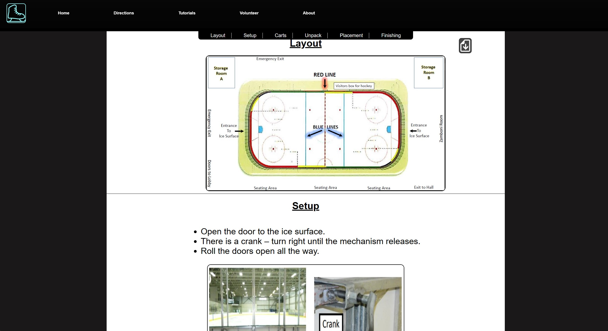

# [Skate NB](https://skatenb.vercel.app/)

A web application that assists a skating organization to source volunteer to help with operations

## Table of Contents

1. [Getting started](#Getting-started)
2. [Feature](#feature)
   - [Homepage](#card_sim)
   - [Directions](#categorization)
   - [Volunteer](#visual)
   - [Tutorials](#prof)
3. [Licenses](#license)
4. [Technologies Used](#tech)

## <a id="Getting-started">Getting started</a>

You can access the site by clicking -> **[Skate NB](https://skatenb.vercel.app/)**

Alternative scan this QR code

## <a id="feature">Features</a>

### <a id="card_sim">Homepage</a>

A simple user interface that's easy to navigate with a click of some buttons

### <a id="categorization">Directions</a>

Users see a Google maps render of the organization's location

### <a id="visual">Volunteer</a>

A user can sign up to assist the organization by filling the form

### <a id="prof">Tutorials</a>

Users can learn on the proper to set up an ice rink for speed skating, there
is an option to download the pdf

### <a id="license">Licenses</a>

The project is licensed under the [BSD 3-Clause "New" or "Revised" License](https://github.com/highlightjs/highlight.js/blob/main/LICENSE)

### <a id="tech">Technologies Used</a>

The project is built using the following technologies:

- Front-end: React.js, React Router, Google maps
- Styling: Pure CSS
- Email Library: Email.js
- Database: Google sheets
